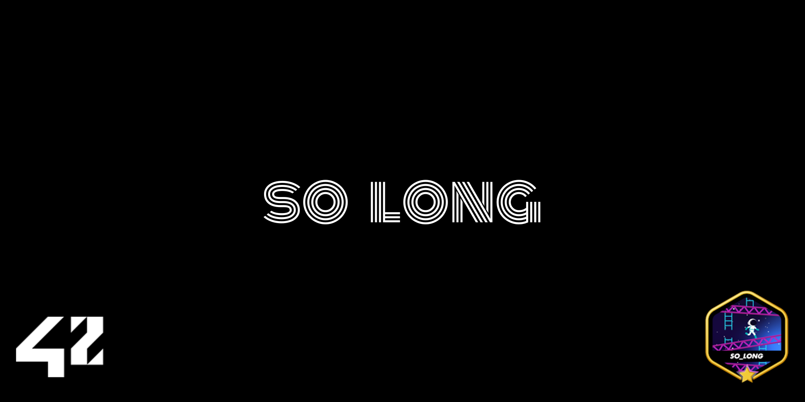
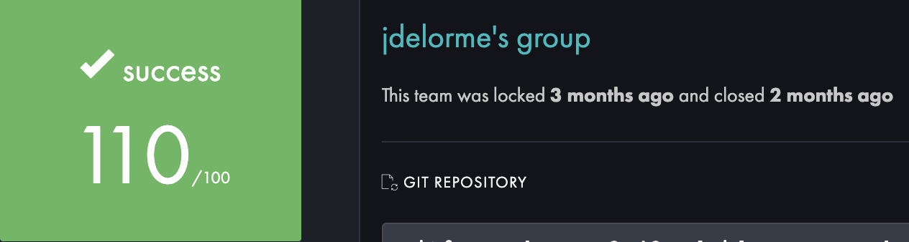
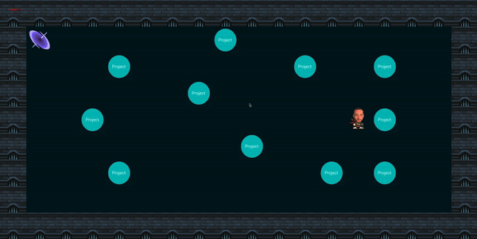
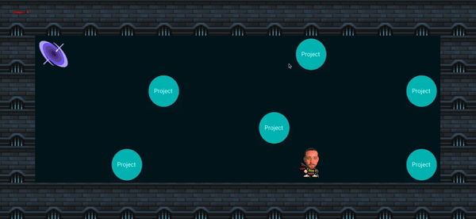
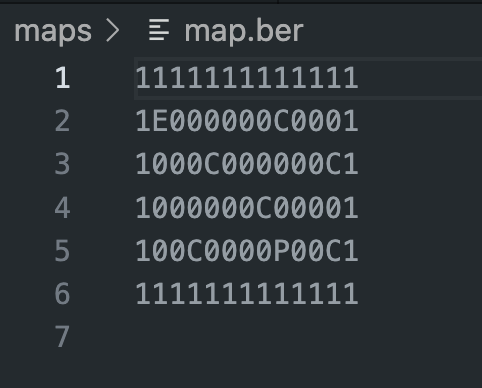

# Readme So_Long

---

---



## And thanks for all the fish!

---

## Evaluation:



## Table of Contents

1. [What is ft_printf?](https://www.notion.so/Printf-Readme-c6233f0ec7234a818d3b524e93278b40?pvs=21)
2. [What’s inside?](https://www.notion.so/Printf-Readme-c6233f0ec7234a818d3b524e93278b40?pvs=21)
3. [How does it work?](https://www.notion.so/Printf-Readme-c6233f0ec7234a818d3b524e93278b40?pvs=21)
4. [How to test ?](https://www.notion.so/Printf-Readme-c6233f0ec7234a818d3b524e93278b40?pvs=21)
5. [Notes](https://www.notion.so/Printf-Readme-c6233f0ec7234a818d3b524e93278b40?pvs=21)
6. [About Me](https://www.notion.so/Printf-Readme-c6233f0ec7234a818d3b524e93278b40?pvs=21)
7. [License](https://www.notion.so/Printf-Readme-c6233f0ec7234a818d3b524e93278b40?pvs=21)

## What is so_long?

---

"So Long" was my fourth project at School 42, which required us to create a 2D video game (Pac-Man style) using the MLX library. The project involved memory management considerations and had the unique feature where the end user, wanting to execute the game, could create the game map using '0' and '1'.

## What’s inside?

---

| Maps | Some maps that you can use to play or test. |
| --- | --- |
| Img | All the sprites and textures needed for the map. |
| Inc | Here is where you can find so_long.h, where you can see all data structures that are used for the game data. |
| Libft | This is my own C library, with some standard and basic functions. |
| Mlx | This is an Objective-C library, used for window and game management. |
| Src | All of my own source code. |

## How does it work?

1. Clone the repo:

```bash
git clone https://github.com/VolmerES/So_Long.git
cd so_long/
```

1. Execute and enjoy:

```bash
make run
```

### Some other Makefile rules you can use:

```bash
make - compila los archivos obligatorios.
make bonus - compila los archivos bonus.
make all - compila todos los archivos (obligatorios + bonus)
make clean - elimina todos los archivos *.o
make fclean - elimina todos los archivos *.o y *.a (ejecutables)
make re - usa fclean + all, recompila.
```

## Screenshots

---





## Make your own map:

---

1. The extension must be "*.ber".
2. The map must be a square/rectangle.
3. The map must be surrounded by walls.
4. The map must have at least 1 or more collectibles, just 1 player, and 1 exit.
5. All collectibles must be reachable.
6. There needs to be a valid path between the player and the exit.

Otherwise, when launching the game, it will show an error followed by a message about the mistake you made.

## Let see what are each character:

---



| 1 | Wall |
| --- | --- |
| 0 | Path |
| E | Exit |
| C | Collectable |
| P | Player |

You are now equipped to construct a map.

## Executing you map:

---

```jsx
./so_long ./(pathofyourmap)/my_map.ber
```

In this game, the conclusion is reached when the player steps onto the exit tile after acquiring every collectible item.

## 🚀 About Me

---

I’m 42Network student at 42Madrid(Spain)

You I track my progress through the common core at:

More about:

[https://img.shields.io/badge/linkedin-0A66C2?style=for-the-badge&logo=linkedin&logoColor=white](https://img.shields.io/badge/linkedin-0A66C2?style=for-the-badge&logo=linkedin&logoColor=white)

## License

---

This project is licensed under the MIT License. See the [LICENSE](https://www.notion.so/LICENSE.md) file for details.
